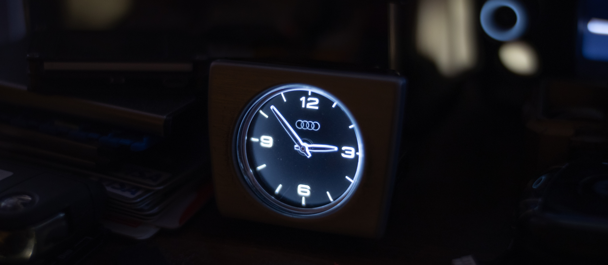

# MQB WiFi Analoguhr

## Feature
- VW/Audi Dash Analog Clock Time Control
    - Backlight
    - WiFi Internet Time Retrival
- Time Injection on Gateway
- Kl15 Status Injection on Gateway
- Kl58d Dimming Injection on Gateway
## Requirements
- An Analog Clock from Audi A8 D3 (tested) or Passat B8 (untested)
- A J533 CAN Gateway Module (Only Tested for MQB Ones) (Need to support MSFW LIN)
- MCP2515 SPI CAN Adapter
- Node32s or UM Tinypico ESP32 (Other ESP32 boards may work, not tested)
- You may need to use some LDO or DC-DC circuit to power the ESP32(5V or 3V3), CAN Gateway(12V) and Analoguhr(12V) together.